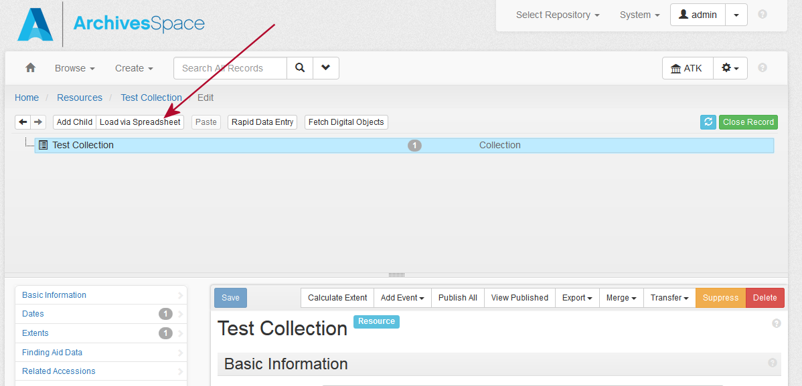
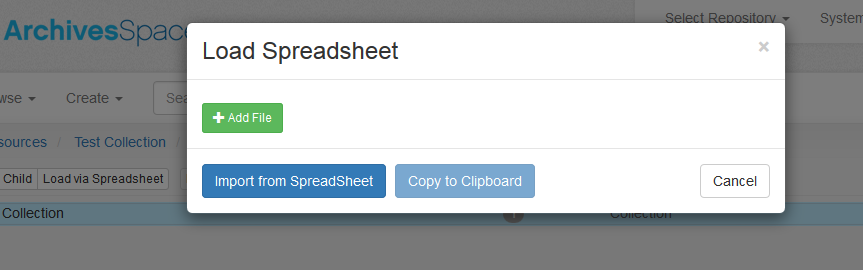

# Using the Excel Spreadsheet Template to add Archival Objects to a Resource
**Note** *that the Resource must already be defined.*

## Initiating the ingest
1. In ArchivesSpace, go to the target Resource in *edit* mode.</li>
2. The "Load via Spreadsheet button
   + **If** the resource has no Archival Objects, or you want your Archival Objects to be appended to the end of the list of first-level Archival Objects, you can click the "Load via Spreadsheet" button here. 
   + **Otherwise**, if you want the first Archival Object in your list to be inserted as a sibling/child (see <a href="#hier">Hierarchical Relationship</a>, below) of an already-existing Archival Object, select that object from the tree.  The page will reload to that Archival Object, again presenting you with the "Load via Spreadsheet" button.
 
3. Click on the button.  You will see a Load Spreadsheet modal window, with the rest of the page "greyed out" 

4. Click on "Add File" to browse and locate a file on your system.  Select the Excel File.
5. Once you've identified the file, click on **"Import from SpreadSheet"**. The Ingester will start; the rest of the page will continue to be "greyed out". 
6. When the ingest is finished, there will be an alert pop-up. 
7. Click to close the popup, and you will be presented with a report of the processing.
8. You can click on "Copy to clipboard" to get a tabbed version of the report to examine and/or save.

## Using the Template to Create a Spreadsheet

The template is designed to be flexible enough to accommodate different workflows.

As long as you **don't edit** the **row** marked *"ArchivesSpace field code"*, you may hide, delete, or rearrange **columns** to suit your workflow.  Indeed, you will see that there are a few already-hidden columns; these are not currently used, but may be used in future enhancements.

**Note**  that some columns already have in-column drop down data validation defined.  You may of course add more of these. See [The Excel help page](https://support.office.com/en-us/article/Apply-data-validation-to-cells-29FECBCC-D1B9-42C1-9D76-EFF3CE5F7249) to learn how to create these. 

### Required Columns

There are very few columns that _must_ be filled in:

* **EAD ID**  - of the resource to which you're adding Archival Objects
* The **<a name="hier">Hierarchical Relationship</a>** of the new Archival Object to the selected resource or selected Archival Object:  **1** if you're adding a sibling to a selected Archival Object, **2** if a child, etc.  If you've selected the Resource, **1** indicates that this is the first level of Archival Objects.  You can therefore describe several levels of Archival Objects in a single spreadsheet.
* **The Description Level**  This is an in-column drop-down. 
* EITHER the **Title** OR a **Creation Date** that must have at least a  begin date  or a date expression.

Below is a discussion of each used column in the spreadsheet. 

For columns where the value is from a Controlled Value List, you can fill in either the controlled list's Value **or** the Translation.  It must be entered **exactly** as it is written (lower case, title case, etc.). As an example (for English), in the *Extent Extent Type* controlled list, "cubic feet" is represented as the **value** "cubic_feet" or the **translation** "Cubic Feet".  Entering "cubic feet" would result in an error message.

Column | Value | Default | Comment
-------|-------|---------|---------
EAD ID | String | | **REQUIRED**
Title  | String| |Title of the Archival Object; required if no Creation Date information
Component Unit Identifier| String | |
Hierarchical Relationship| number | | **REQUIRED**
Description Level| in column drop-down || **REQUIRED**
Publish?| in column drop-down | **False** | This is applied to any information (such as subject, note) created with this Archival Object
Restrictions Apply? | in column drop-down | **False** | 
Processing Note | String | |

### Dates

A Date must have **at least** either a *begin date* or a *date expression.*

Column | Value | Default | Comment
-------|-------|---------|---------
Dates Label | String | creation| from the *Date Label* controlled value list
Date Begin | a Date string || in one of the following: **YYYY, YYYY-MM, or YYYY-MM-DD**
Date End | a Date string || in one of the following: **YYYY, YYYY-MM, or YYYY-MM-DD**
Date Type | in column drop-down| *inclusive*| 
Date Expression |String||
Date Certainty |String | from the *Date Certainty* controlled value list

