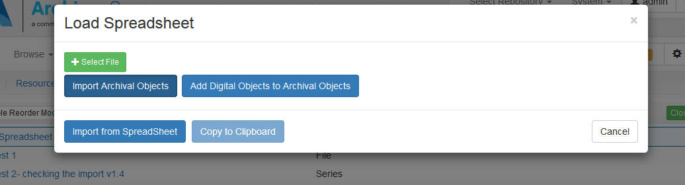
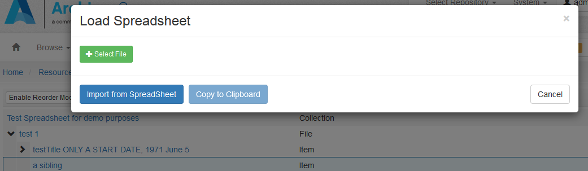

# Using This Plugin to Ingest Spreadsheets

As of version V2.1.0, the *aspace-import-excel* plugin supports both the **Import Archival Objects** (original) spreadsheet ingest and the new **Add Digital Objects to Archival Objects** ingest method.

## Common Workflow:
  
  1.  Make sure the plug-in has been installed! See the Installation Instructions in the [main README document](../README.md)
  1. Download the appropriate Excel Spreadsheet template.
     + For **Import Archival Objects**, use [aspace_import_excel_template.xlsx](https://github.com/harvard-library/aspace-import-excel/blob/master/templates/aspace_import_excel_template.xlsx)
     + For **Add Digital Objects to Archival Objects**, use [aspace_import_excel_DO_template.xlsx](https://github.com/harvard-library/aspace-import-excel/blob/master/templates/aspace_import_excel_DO_template.xlsx)
   It's recommended that you make a copy of this template, renaming it to something identifiable, e.g.: ead_foo234.xslx)
  
  1. Identify your Resource EAD ID.  For importing Archival Objects, this may represent a Resource with no Archival Objects.  Obviously, if you're adding Digital Objects to Archival Objects, the Resource must have the corresponding Archival Objects!
  1. Fill in your spreadsheet.  Use either the  [Instructions for Importing Archival Objects](archival_objects_instructions.md) or [Instructions for Adding Digital Objects to Archival Objects](digital_objects_instructions.md), as appropriate
  1. Use the plugin to <a href="#ingest">ingest the spreadsheet</a>.

**Note** *The Resource must already be defined, with an EAD ID, in ArchivesSpace before initiating the ingest*

## <a name="ingest">Initiating the ingest</a>
  1. In ArchivesSpace, where you invoke the ingest depends on what you are trying to do.
     +  Locate the desired Resource record **if**:
       + the resource has no Archival Objects; or 
       + you want to create Archival Objects to be appended to the end of the list of first-level Archival Objects; or
       + you want to add Digital Objects to Archival Objects.
         
     + **Otherwise**, if you want the first Archival Object in your list to be inserted as a sibling/child (see <a href="archival_objects_instructions.md#hier">Hierarchical Relationship</a>, below) of an *already-existing* Archival Object, locate the Archival Object where you want to begin your insertion. You can either search for it or select it from the tree that displays on the Resource record. In the latter case, the page will reload to that Archival Object.

  2. When you have displayed the Resource or the Archival Object as appropriate, make sure you are in *edit* mode. A "Load via Spreadsheet" button will appear. 

  3. Click on the button.  You will see a Load Spreadsheet modal window, with the rest of the page "greyed out". 
     If you are at the Resource level, the modal window will look like this: 
     If you at the Archival Object leve, the modal window will look like this: 
     
  4. Click on "Add File" to browse and locate a file on your system.  Select the Excel File.
  5. Click on either the **Import Archival Objects** or **Add Digital Objects to Archival Objects** button, if you are given the choice.
  5. Click on **"Import from SpreadSheet"**. The Ingester will start; the rest of the page will continue to be "greyed out". 
  6. When the ingest is finished, there will be an alert pop-up. 
  7. Click to close the popup, and you will be presented with a report of the processing.
  8. You can click on "Copy to clipboard" to get a tabbed version of the report to examine and/or save.
  
*<a href="#workflow">back to Workflow</a>* 
