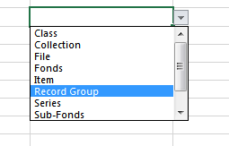

# Import Archival Objects

## <a name="spreadsheet">Using the Template to Create a Spreadsheet</a>

The Excel Spreadsheet template for importing Archival Objects is at https://github.com/harvard-library/aspace-import-excel/blob/master/templates/aspace_import_excel_template.xlsx .

Use **Save as**  *(your new filename}*.xlsx to begin creating your spreadsheet.

The template is designed to be flexible enough to accommodate different workflows.  The first row is the place where you can put identifying information, such as "Foo Collection".

As long as you **don't edit** the **row** marked *"ArchivesSpace field code"*, you may hide, delete, or rearrange **columns** to suit your workflow.  Indeed, you will see that there are a few already-hidden columns; these are not currently used, but may be used in future enhancements.

**Note**  that some columns already have in-column drop down data validation defined.  You may of course add more of these, or edit the ones that are already defined. See [The Excel help page](https://support.office.com/en-us/article/Apply-data-validation-to-cells-29FECBCC-D1B9-42C1-9D76-EFF3CE5F7249) to learn how to create these. 

<a href="#defs">Column Definitions</a> \| <a href="#dates">Dates</a> \| <a href="#extent">Extent</a> \| <a href="#contain">Container</a> \| <a href="#digital">Digital Objects</a> \| <a href="#agent">Agents</a> \| <a href="#subject">Subjects</a> \| <a href="#note">Notes</a>

### <a name="required">Required Columns</a>

There are very few columns that _must_ be filled in:

* **EAD ID**  - of the resource to which you're adding Archival Objects. This will be used to confirm that you are trying to add your spreadsheet information to the correct resource. 
* The **<a name="hier">Hierarchical Relationship</a>** of the new Archival Object to the selected resource or selected Archival Object: If you've selected a Resource, **1** indicates that this is the first level of Archival Objects.  If you have selected an Archival Object, use **1** if you're adding a sibling to a selected Archival Object, **2** if a child, etc. You can therefore describe several levels of Archival Objects in a single spreadsheet.
* **The Description Level**  This is an in-column drop-down. 
* EITHER the **Title** OR a **Creation Date** that must have at least a  begin date  or a date expression.

## <a name="defs">Column Definitions</a>

Below is a discussion of each used column in the spreadsheet. 

For columns where the value is from a Controlled Value List, you can fill in either the controlled list's Value **or** the Translation.  It must be entered **exactly** as it is written (lower case, title case, etc.). As an example (for English), in the *Extent Extent Type* controlled list, "cubic feet" is represented as the **value** "cubic_feet" or the **translation** "Cubic Feet".  Entering "cubic feet" would result in an error message.

Column | Value | Default | Comment
-------|-------|---------|---------
EAD ID | String | | **REQUIRED**
Title  | String| |Title of the Archival Object; required if no Creation Date information
Component Unit Identifier| String | |
Hierarchical Relationship| Number | | **REQUIRED**
Description Level| in column drop-down || **REQUIRED** *from the Archival Record Level controlled value list*
Other Level| String | *unspecified*| This is used if *Other Level* was specified in the **Description Level**
Publish?| in column drop-down | **False** | This is applied to any information (such as subject, note) created with this Archival Object
Restrictions Apply? | in column drop-down | **False** | 
Processing Note | String | | No markup allowed

<a href="#defs">Column Definitions</a> \| <a href="#dates">Dates</a> \| <a href="#extent">Extent</a> \| <a href="#contain">Container</a> \| <a href="#digital">Digital Objects</a> \| <a href="#agent">Agents</a> \| <a href="#subject">Subjects</a> \| <a href="#note">Notes</a>

### <a name="dates">Dates</a>

A Date must have **at least** either a *begin date* or a *date expression.*

Column | Value | Default | Comment
-------|-------|---------|---------
Dates Label | String | creation| from the *Date Label* controlled value list
Date Begin | a Date string || in one of the following: **YYYY, YYYY-MM, or YYYY-MM-DD**
Date End | a Date string || in one of the following: **YYYY, YYYY-MM, or YYYY-MM-DD**
Date Type | String| *inclusive*| from the *Date Type* controlled value list
Date Expression |String||
Date Certainty |String | | from the *Date Certainty* controlled value list

<a href="#defs">Column Definitions</a> \| <a href="#dates">Dates</a> \| <a href="#extent">Extent</a> \| <a href="#contain">Container</a> \| <a href="#digital">Digital Objects</a> \| <a href="#agent">Agents</a> \| <a href="#subject">Subjects</a> \| <a href="#note">Notes</a>

### <a name="extent">Extent Information</a>

Extent information is not required, but if you are defining an extent, please note the required fields.

Column | Value | Default | Comment
-------|-------|---------|---------
Extent portion | String| whole| from the *Extent Portion* controlled value list
Extent number | Number||**REQUIRED** 
Extent type | String| |**REQUIRED** from the *Extent Extent Type* controlled value list
Container Summary|String||
Physical details |String||
Dimensions| String ||

<a href="#defs">Column Definitions</a> \| <a href="#dates">Dates</a> \| <a href="#extent">Extent</a> \| <a href="#contain">Container</a> \| <a href="#digital">Digital Objects</a> \| <a href="#agent">Agents</a> \| <a href="#subject">Subjects</a> \| <a href="#note">Notes</a>

### <a name="contain">Container Information  - Creating a Container Instance</a>

A Container instance associates the Archival Object with a Top Container, with additional information on Child and Grandchild sub-containers if present.

The ingester will try to find an already-created Top Container in the database.
+ If you have defined a barcode:
   + If there's a match for that repository, that Top Container will be used without further checking.
   + Otherwise, a new Top Container will be created.
+ If you have not defined a barcode:
   + The type and indicator will be used to search the database for a Top Container that is already associated with the resource;
   + Otherwise, a new Top Container will be created.

**NOTE:** if you want the object in this spreadsheet to be in a Top Container shared with *another Resource*, you must either specify the container by *barcode* or else make sure that at least one archival object in the spreadsheet's Resource with that container has already been created via the usual ArchivesSpace interface.  

If you are specifying container information, note that both **type** and **indicator** are required for each level (top, child, and grandchild) you want to specify.

Column | Value | Default | Comment
-------|-------|---------|---------
Container Instance type| String | | **REQUIRED** if you are defining a Container Instance. Value from the *Instance Instance Type* controlled value list
Top Container type | String | Box| from the *Container Type* controlled value list
Top Container indicator|String | Unknown || **REQUIRED**
Child type | String||from the *Container Type* controlled value list
Child indicator|String |Unknown   || *only used if a Child type is specified*
Grandchild type | String||from the *Container Type* controlled value list
Grandchild indicator|String | Unknown  || *only used if a Grandchild type is specified*

<a href="#defs">Column Definitions</a> \| <a href="#dates">Dates</a> \| <a href="#extent">Extent</a> \| <a href="#contain">Container</a> \| <a href="#digital">Digital Objects</a> \| <a href="#agent">Agents</a> \| <a href="#subject">Subjects</a> \| <a href="#note">Notes</a>

### <a name="digital">Digital Objects</a>

Ingest allows you to create a Digital Object, and associate it with the Archival Object.  The "publish" state will be whatever the "publish" state of the Archival Object has been defined to be.

Column | Value | Default | Comment
-------|-------|---------|---------
Digital Object Title| String || If no Digital Object Title is provided, the display header string of the parent Archival Object will be used.
URL of Linked-out digital object| URL String ||  this becomes the File Version with the **actuate_attribute** set to "onRequest" and the **show_attribute** set to "new"
URL of thumbnail| URL String ||  if defined, this becomes the File version with the **actuate_attribute** set to "onLoad", the **show_attribute** set to "embed", and the "is representative" flag is set to TRUE.

<a href="#defs">Column Definitions</a> \| <a href="#dates">Dates</a> \| <a href="#extent">Extent</a> \| <a href="#contain">Container</a> \| <a href="#digital">Digital Objects</a> \| <a href="#agent">Agents</a> \| <a href="#subject">Subjects</a> \| <a href="#note">Notes</a>

### <a name="agent">Agent Objects</a>

The ingester allows you to link Agents (*CREATOR role only!*) to Archival objects.  You can specify up to 3 Person Agents, up to 2 Corporate Agents, and one Family Agent per Archival object.

If you have previously defined the Agent(s) you are using, you may use the Record ID number (e.g.:  for the Agent URI /agents */agent_person/1249*, you would use **1249**) OR the full header header string, with all capitalization and punctuation.

Either the Record ID *or* the header string is **required**; if you include both, and the record isn't found, a new Agent record will be created.  The header string will be used as the **family_name** if it's a Family Agent, and the **primary_name**  otherwise.

If for some reason you enter a Record ID and **not** the header string, and that ID is not found, a new Agent record will be created with the name "PLACEHOLDER FOR *{agent type}* ID *{ id number}* NOT FOUND", so that you may easily find that record later and edit/merge it. In this case, the new Agent would be marked publish=false. When you correct the record, change publish to true if appropriate.

#### Person agents:

Column | Value | Default | Comment
-------|-------|---------|---------
Agent/Creator (1) Record ID  | Number||
Agent/Creator (1) header string  |String|| must be the entire header, including punctuation & capitalization
Agent/Creator (1) Relator|String|| If supplying relator, term must be from the *Linked Agent Archival Record Relators*  controlled value list.
Agent/Creator (2) Record ID  | Number||
Agent/Creator (2) header string  |String|| must be the entire header, including punctuation & capitalization
Agent/Creator (2) Relator|String||  If supplying relator, term must be from the *Linked Agent Archival Record Relators*  controlled value list.
Agent/Creator (3) Record ID  | Number||
Agent/Creator (3) header string  |String|| must be the entire header, including punctuation & capitalization
Agent/Creator (3) Relator|String||  If supplying relator, term must be from the *Linked Agent Archival Record Relators*  controlled value list.

#### Family Agent:
Column | Value | Default | Comment
-------|-------|---------|---------
Family Agent/Creator  Record ID  | Number||
Family Agent/Creator header string  |String|| must be the entire header, including punctuation & capitalization
Family Agent/Creator Relator|String|| If supplying relator, term must be from the *Linked Agent Archival Record Relators*  controlled value list.

#### Corporate Agents:
Column | Value | Default | Comment
-------|-------|---------|---------
Corporate Agent/Creator  Record ID  | Number||
Corporate Agent/Creator header string  |String|| must be the entire header, including punctuation & capitalization
Corporate Agent/Creator Relator|string||  If supplying relator, term must be from the *Linked Agent Archival Record Relators*  controlled value list.
Corporate Agent/Creator  Record ID (2)  | Number||
Corporate Agent/Creator header string (2)  |String|| must be the entire header, including punctuation & capitalization
Corporate Agent/Creator Relator (2)|String||  If supplying relator, term must be from the *Linked Agent Archival Record Relators*  controlled value list.

<a href="#defs">Column Definitions</a> \| <a href="#dates">Dates</a> \| <a href="#extent">Extent</a> \| <a href="#contain">Container</a> \| <a href="#digital">Digital Objects</a> \| <a href="#agent">Agents</a> \| <a href="#subject">Subjects</a> \| <a href="#note">Notes</a>

### <a name="subject">Subjects</a>

As with <a href="#agent">Agents</a>, you may associate Subjects with the Archival Object.  You may associate up to two Subject records.  If you know the Record ID, you may use that instead of the **term**, **type**, and **source** in a manner similar to the way that Agent specifications are made, with the same database lookup and handling done there.  Again, if you want the ingest to look up the **term** in the database, you must use the entire Subject header, including any punctuation or capitalization.

Column | Value | Default | Comment
-------|-------|---------|---------
Subject (1) Record ID|Number||
Subject (1) Term |String ||
Subject (1) Type | String| topical|   from the *Subject Term Type*  controlled value list 
Subject (1) Source | String| ingest| from the *Subject Source* controlled value list 
Subject (2) Record ID|Number||
Subject (2) Term |String ||
Subject (2) Type | String| topical|   from the *Subject Term Type*  controlled value list 
Subject (2) Source | String| ingest| from the *Subject Source* controlled value list 

<a href="#defs">Column Definitions</a> \| <a href="#dates">Dates</a> \| <a href="#extent">Extent</a> \| <a href="#contain">Container</a> \| <a href="#digital">Digital Objects</a> \| <a href="#agent">Agents</a> \| <a href="#subject">Subjects</a> \| <a href="#note">Notes</a>

### <a name="note">Notes fields</a>

You may specify a variety of notes fields.

If the note type allows for subfields, what you specify will be put in the first subfield.

As does ArchivesSpace, you may used Mixed Content (EAD/XML markup).  The Ingester will check to make sure that the entry is "well formed" -- that is, that the opening and closing elements match -- but will **not** validate the text to make sure you're using the proper markup.

The following Notes fields are supported:

+ Abstract
+ Access Restrictions
+ Acquisition Information	
+ Arrangement
+ Biography/History
+ Custodial History
+ Dimensions
+ General	
+ Language of Materials
+ Physical Description
+ Physical Facet
+ Physical Location
+ Preferred Citation
+ Processing Information
+ Related Materials
+ Scope and Contents
+ Separated Materials
+ Use Restrictions

<a href="#defs">Column Definitions</a> \| <a href="#dates">Dates</a> \| <a href="#extent">Extent</a> \| <a href="#contain">Container</a> \| <a href="#digital">Digital Objects</a> \| <a href="#agent">Agents</a> \| <a href="#subject">Subjects</a> \| <a href="#note">Notes</a>
