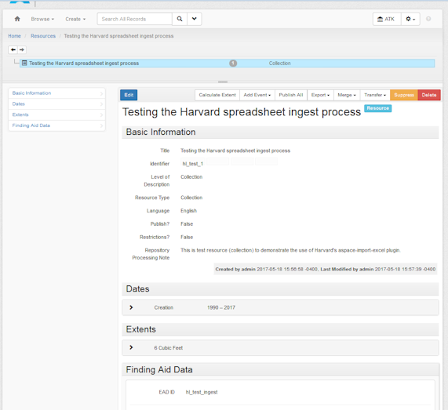
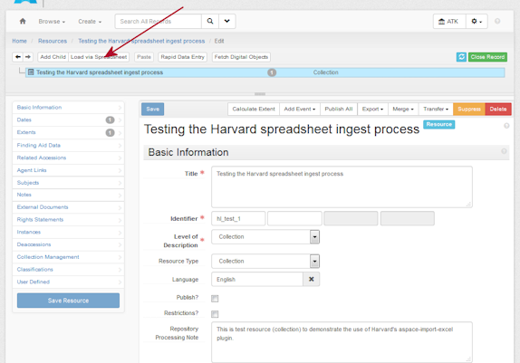
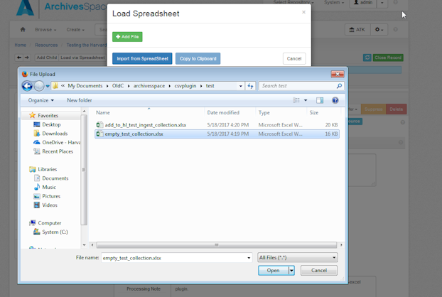
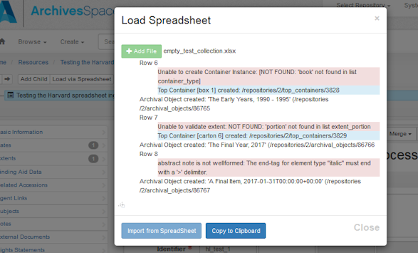
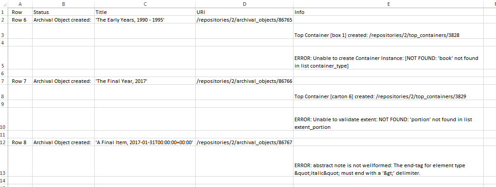
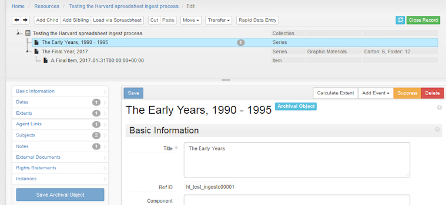
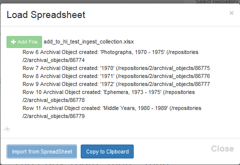

# An Example of Using aspace-import-exel

Included in this directory are two spreadsheets which you can use to follow the step-by-step description below, where you create an empty Resource, populate it with the first spreadsheet, then add to it with the second.

## Create a new Resource

Create a new Resource of type **Collection**. You make it as minimal as you like, but you must assign an EAD ID of **hl_test_ingest**.  Don't create any archival objects for it.

## Loading the First Spreadsheet

### <a name="first">Select the Spreadsheet</a>

With your new Resource in *edit* mode, click on the "Load via Spreadsheet" button.

Click on the **Add File** button, and select the **empty_test_collection.xlsx** file, that you've downloade from <a href="empty_test_collection.xlsx">here</a> . This spreadsheet creates two top level "Series" Archival Objects; the second Archival Object will also have a child "Item" object.  There are a few errors in the spreadsheet, so that you can see the error reporting mechanism.

Here's what it looks like from an MS Windows view:

### Click "Import From Spreadsheet"

The importer will "gray out" that button, and begin processing.  When it is completed, you will see a confirmation pop-up:

Click "OK", and you will be presented with the report of the results:

### Copying the results

If you click on the "Copy to Clipboard" button, you will get a "Copied" confirmation popup.  You will now have
 get a tabbed copy of the results in your clipboard, which you can then paste into a text file, Word document, Excel spreadsheet, etc.  We've pasted it into an Excel spreadsheet, which we've also <a href="results/first_ss_report.xlsx">uploaded to GitHub</a>:

### <a name="ad_error">Addressing errors</a>

Reading the results, you will see that the processing of each Archival Object did not go smoothly.  For example, for the object **"The Early Years,1990 - 1995"**, a Container instance was not created because there was a problem with the container *child type*. 

You can interactively create a Container instance for that object.  We suggest you use the Top Container ("Box 1") that was created, because it's referenced in the next spreadsheet.  Otherwise, a second free-standing "Box 1" Top Container will be created when the second spreadsheet is run.

Similarly, you can edit the other two objects, if you like.

## Adding Children and Siblings to the new Resource

### Select Your Upload Point

With your Resource in **edit** mode, select the "**The Early Years, 1990 - 1995**" archival object.

### Load Spreadsheet

As <a href="#first">above</a>, click on "Load via Spreadsheet", add the **add_to_hl_test_ingest_collection.xlsx** file that you've downloaded from <a href="add_to_hl_test_ingest_collection.xlsx">here</a>, then click on "Import from SpreadSheet".

### Results

These are the expected results: 

If you had not edited the "**The Early Years, 1990 - 1995**" archival object to add the Container instance, as described <a href="#ad_errors">above</a>, you will also see a "Top Container [box 1] created..." message.

These results also were copied and pasted into an Excel spreadsheet:

We have also uploaded the actual spreadsheet <a href="results/add_ss_load_report.xlsx">here</a>.

